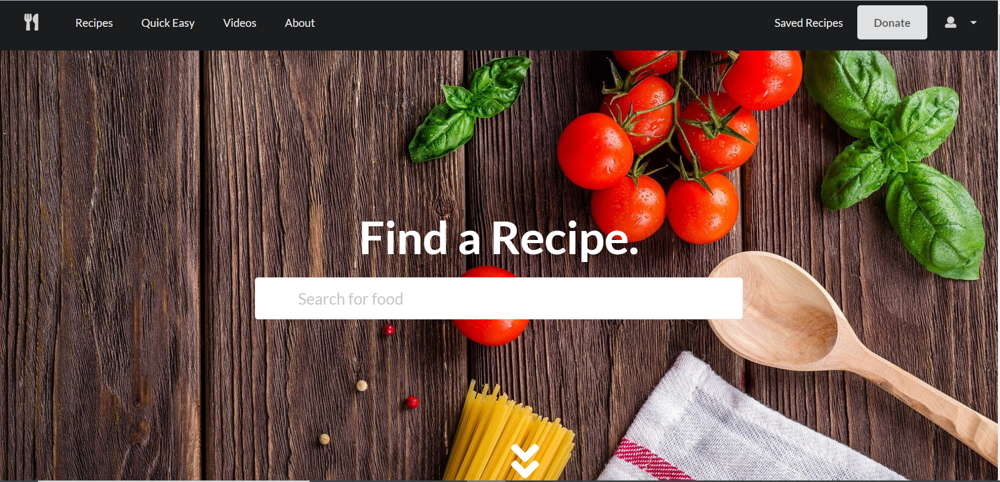

# Supreme Recipes

# Description

In this project we create a full stack online recipe website. We used the MERN web development framework to design our website. Additionally, we used the Spoonacular API to populate and fetch different recipes.



# Pre-requisites

- Install [Node.js](https://nodejs.org/en/) version 8.0.0

# Getting started

- Clone the repository

```
git clone <git@github.com:shanebramble/project3.git>
```

- Install dependencies

```
cd <project_name>
npm install
```

- Build and run the project

```
npm start
```

### Heroku Deployed Website

<https://tranquil-tundra-91297.herokuapp.com/>

### Built With

- JavaScipt
- Node.js
- MySQL
- React
- MongoDB
- Semantic UI
- GraphQl
- Express

## Contributions

- Alexandria Clarke

- Kyairla Davis
- Shane Bramble-Wade
- Shannon Posey

### ©️2021 Supreme Recipe, Inc
